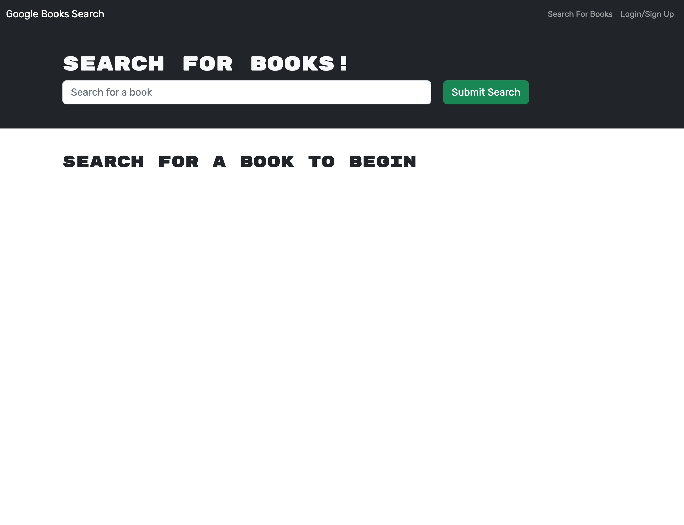
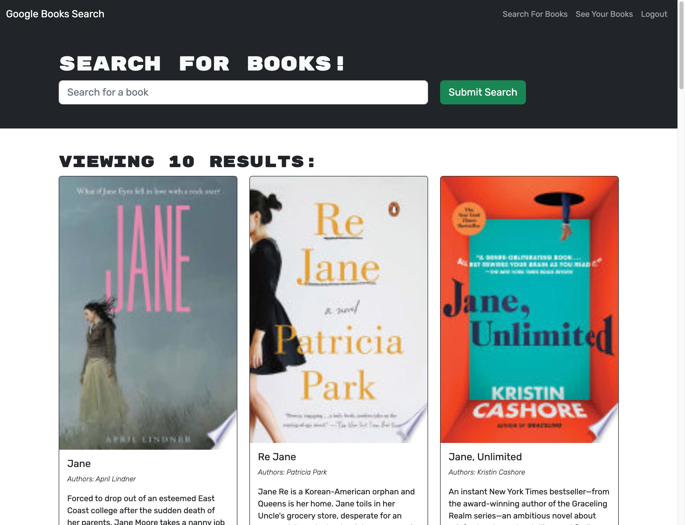

# Book Searcher

## Description

Book Searcher is a search engine that uses the Google Books API so that users can search for books and save books they are interested in reading later on. This application is built with the Apollo Server and uses GraphQL mutations and queries to read and modify data

## Installation

N/A

## Usage

To start, sign up or log in by clicking on the link in the top right corner. After signing up, enter a keyword or a book title and click on the Submit Search button to search for a book. Soon, the page will render results from the Google Books API. At the bottom of the results, there is a Save Book button. Click on the button if you want to bookmark the book for future references. If you want to see books that you bookmarked, click on the See Your Books link.

> Link to deployed application: https://shielded-peak-97192.herokuapp.com/

### Screenshots of Application
- Screenshot of homepage

- Screenshot of search results

- Screenshot of saved books

## Credit

Thank you to Bryan Swarthout for providing the code!

## License

This repository is licensed under the [MIT License](https://opensource.org/licenses/MIT).